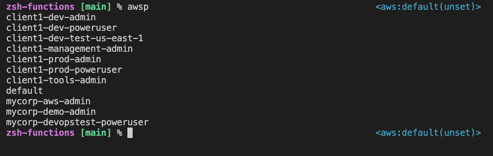
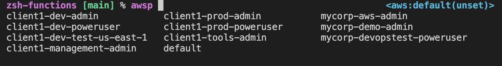
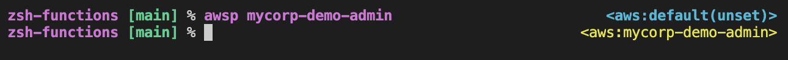
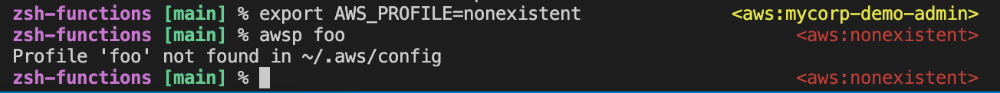

# awsp

AWS profile management plugin for ZSH.

Inspired by https://github.com/ohmyzsh/ohmyzsh/blob/master/plugins/aws/aws.plugin.zsh.

Improvements: colors, intuitive usage.

## Installation
```
git clone git@github.com:suonto/awsp-zsh-plugin.git ~/.oh-my-zsh/custom/plugins/awsp
```
Modify `~/.zshrc` plugins to include `awsp`. Open a new shell.

## Configuration
```
cp ~/.oh-my-zsh/custom/plugins/awsp/awsp_colors.default.sh ~/.oh-my-zsh/custom/plugins/awsp/awsp_colors.sh
vi ~/.oh-my-zsh/custom/plugins/awsp/awsp_colors.sh
```
Note: color matching currently supports wildcard (*) only as the last character.

## Usage
```
% awsp --help
Usage: awsp [OPTIONS] [PROFILE]

An intuitive aws profile manager.

Reads profile data from ~/.aws/config.

Options:
  -h, --help    Get help
  -d, --disable Remove aws profile information from RPROMPT

Set AWSP_RPOMPT_OPT_OUT to any non-empty value to permanently opt
out of RPROMPT info.
```

### Features
List by default:

Autocomplete:

Colors:

Mistake detection:


#### Extension awsps (aws profile show)
Shows all details of the current aws profile.
